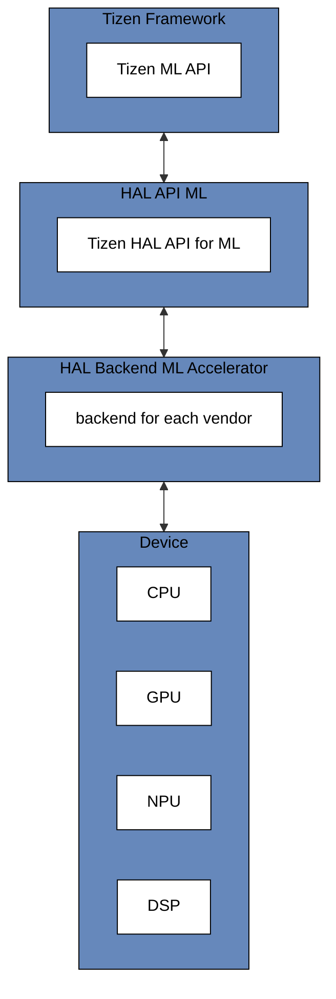

# HAL ML API Overview

## Introduction

The HAL ML API provides an interface for [Tizen's higher-level Machine Learning API](https://docs.tizen.org/application/native/guides/machine-learning/overview) to interact with various hardware acceleration devices (e.g., NPUs, GPUs, DSPs) via [HAL ML Accelerator Backends](https://github.com/nnstreamer/hal-backend-ml-accelerator). **Users would not use this directly**, it is used in implementation of [NNStreamer](https://github.com/nnstreamer/nnstreamer)'s `tensor_filter` sub-plugin which is backend of Tizen ML API.

## Architecture

## License

This project is licensed under the Apache License, Version 2.0. See the [LICENSE](LICENSE) file for details.
